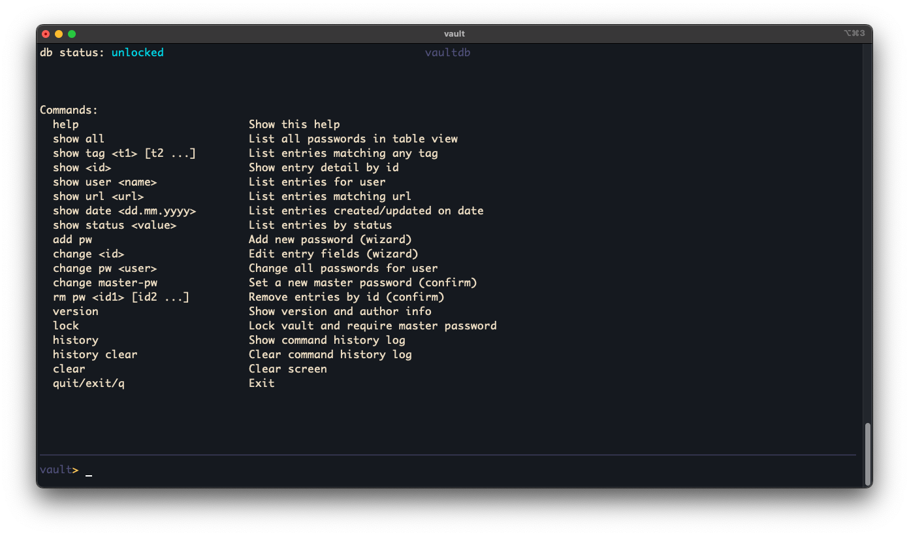

# vaultdb

Simple terminal-based password vault built with ncurses. It stores entries in a CSV-like file that is lightly obfuscated. Intended for learning and experimentation, **not** for protecting real secrets.



## Platform Support
- Built and run on macOS (Darwin, ncurses).
- Expected to work on Linux and BSD variants with a C11 compiler and `ncurses` installed.
- Windows support is not verified; use WSL or a curses layer such as PDCurses/WinLibc if attempting a native build.

## Security Notice
- Data is only XOR-obfuscated with the master password; this is not cryptographically secure.
- Use the program for testing and practice only; do not store sensitive credentials.
- The master password gates access but should be considered easily brute-forced if the DB is obtained.

**How XOR obfuscation works (toy example):**
Let `P` be a plaintext byte and `K` the matching byte of the key. The stored byte is `C = P ⊕ K`. To read, compute `P = C ⊕ K`. Example: `P = 0x41 ('A')`, `K = 0x2B`, then `C = 0x41 ⊕ 0x2B = 0x6A`; recovering: `0x6A ⊕ 0x2B = 0x41`.

## Installation
Prerequisites: C11-compatible compiler and `ncurses` development headers.

Clone from GitHub
```sh
# Prepare the dev directory, change it if it differs from yours ;-):
mkdir ~/dev/
cd ~/dev/
git clone https://github.com/rtulke/vaultdb.git
```
Build locally:
```sh
make
```

Install the binary (defaults to `/usr/bin/vault`, override with `BINDIR=/custom/bin`):
```sh
make install
```

Uninstall (prompts before deleting the database):
```sh
make uninstall
```
## Installation System-wide
Prerequisites: C11-compatible compiler and `ncurses` development headers and sudo.

Clone from GitHub
```sh
# Prepare the dev directory, change it if it differs from yours ;-):
mkdir ~/dev/
cd ~/dev/
git clone https://github.com/rtulke/vaultdb.git
```
Build locally:
```sh
make
```

Install the binary (defaults to `/usr/bin/vault`, override with `BINDIR=/custom/bin`):
```sh
sudo make install
```

Uninstall (prompts before deleting the database):
```sh
sudo make uninstall
```

### Root vs. regular user
- Running as root stores the database at `/var/lib/vaultdb/vault.db` and the log at `/var/log/vault.log`.
- Running as a regular user stores the database at `~/.vault.db` and the log at `~/.vault.log`.

## What the tool does
Interactive vault for keeping test credentials: add, view, edit, delete entries with fields such as description, user, password, URL, tags, dates, and status. Provides a basic wizard, command logging, and tab completion in the TUI.

## Commands
| Command | Description |
| :--- | :--- |
| `help` | Show available commands. |
| `show all` | List all entries in a table. |
| `show tag <t1> [t2...]` | List entries matching any of the given tags. |
| `show <id>` | Show details for entry by ID. |
| `show user <name>` | List entries for a user. |
| `show url <url>` | List entries whose URL contains the value. |
| `show date <dd.mm.yyyy>` | List entries created or updated on that date (prefix match). |
| `show status <value>` | List entries with a given status. |
| `add pw` | Add a new entry via wizard. |
| `change <id>` | Edit an entry via wizard. |
| `change pw <user>` | Replace all passwords for a user (optionally generate). |
| `change master-pw` | Set a new master password. |
| `rm pw <id1> [id2...]` | Delete entries by ID after confirmation. |
| `lock` | Save, lock the vault, and require master password to unlock. |
| `history` | Show command history log. |
| `history clear` | Clear command history log. |
| `clear` | Clear the screen. |
| `version` | Show version/author info. |
| `quit` / `exit` / `q` | Save and exit. |

## Features
- ncurses TUI with colorized header/body and centered dialogs.
- Auto-lock after 5 minutes of inactivity.
- Tab completion for commands, IDs, users, tags, and statuses.
- Obfuscated CSV database persisted to `~/.vault.db` (or system locations when root).
- Command history logging to `~/.vault.log`.
- Wizard-driven entry creation and edits, including optional password generation.

## Brute-force testing helpers
Purpose-built for demonstrations to highlight the weak XOR obfuscation. Do not use for unauthorized access.

### Wordlist mode

Reads candidates from the wordlist until the CSV header decrypts.
```sh
python3 scripts/bruteforce.py wordlist --db ~/.vault.db --wordlist /path/to/wordlist.txt
```

### Exhaustive mode

```sh
python3 scripts/bruteforce.py exhaustive --db ~/.vault.db --min-len 4 --max-len 6 --charset alnum-special --special "%$#-+." --workers 4
```
Enumerates every combination in the length range using charset presets:
 - `digits`, `letters`, `alnum`, `special`, `digits-special`, `letters-special`, `alnum-special`
 - `--special` overrides the special-character set for presets that include specials.
- `--workers` sets parallel processes (default: detected CPU cores). Note that search space grows exponentially with length; keep ranges small for tests.
- Common special-character sets in real-world passwords often include symbols like `!@#$%^&*()-_=+[]{};:'",.<>/?\`~`. Use `--special` to reflect the set you want to test.

### Parameter reference (bruteforce.py)

| Parameter | Subcommand | Description |
| --- | --- | --- |
| `--db PATH` | both | Path to database (default: `~/.vault.db`). |
| `--wordlist PATH` | wordlist | Wordlist file, one candidate per line (required). |
| `--min-len N` / `--max-len N` | exhaustive | Minimum / maximum key length (required). |
| `--charset {digits,letters,alnum,special,digits-special,letters-special,alnum-special,common-special,custom}` | exhaustive | Charset preset for generator. |
| `--special CHARS` | exhaustive | Override specials for presets that include specials. |
| `--chars CHARS` | exhaustive | Custom charset when using `--charset custom`. |
| `--workers N` | exhaustive | Parallel processes (default: detected CPU cores). |
| `--max-tries N` | both | Abort after N candidates. |
| `--time-limit SECONDS` | both | Abort after N seconds. |
| `--progress-every N` | both | Print progress every N attempts (defaults: 100000 wordlist, 50000 exhaustive). |
| `--max-matches N` | both | Stop after N matches (default: 1). |
| `--quiet` | both | Suppress progress output. |
| Charset presets | exhaustive | Available presets: `digits`, `letters`, `alnum`, `special`, `digits-special`, `letters-special`, `alnum-special`, `common-special`, `custom` (`--chars` required). |

Example runs:

```sh
# Minimal wordlist run with default DB
python3 scripts/bruteforce.py wordlist --wordlist /tmp/rockyou.txt
```

```sh
# Wordlist run with caps and quieter progress
python3 scripts/bruteforce.py wordlist --db ~/.vault.db --wordlist ./small.txt --max-tries 500000 --time-limit 10 --progress-every 20000
```

```sh
# Stop after first two matches from wordlist
python3 scripts/bruteforce.py wordlist --wordlist ./candidates.txt --max-matches 2
```

```sh
# Exhaustive: digits only, 4–6 chars, 4 workers
python3 scripts/bruteforce.py exhaustive --min-len 4 --max-len 6 --charset digits --workers 4
```

```sh
# Exhaustive: alnum+special with custom specials and time limit
python3 scripts/bruteforce.py exhaustive --min-len 4 --max-len 5 --charset alnum-special --special "%$#-+." --time-limit 15 --workers 6
```

```sh
# Exhaustive: common-special preset (letters+digits+common symbols), stop after 100k tries
python3 scripts/bruteforce.py exhaustive --min-len 4 --max-len 4 --charset common-special --max-tries 100000
```

```sh
# Exhaustive: custom charset, very small space to demonstrate progress
python3 scripts/bruteforce.py exhaustive --min-len 3 --max-len 3 --charset custom --chars "abc123!" --progress-every 5000
```

```sh
# Exhaustive: run quietly (no progress logs)
python3 scripts/bruteforce.py exhaustive --min-len 4 --max-len 4 --charset letters --quiet
```
